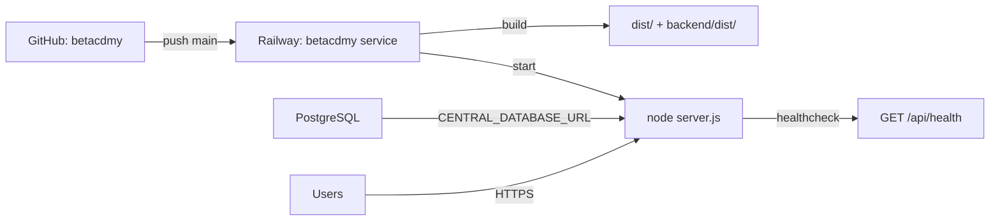

# Railway Setup Guide — Betacademy SaaS

**Last Updated:** June 2026

This guide explains how to connect the Betacademy project to Railway and fix common deployment issues.

---

## Quick Overview

| Item | Value |
|------|-------|
| Platform | [Railway](https://railway.app) |
| Repository | `naioshapp26-ship-it/betacdmy` |
| Build command | `npm run build` |
| Start command | `node server.js` |
| Node version | `20.11.1` (from `.nvmrc`) |
| Health check | `GET /api/health` |

---

## Step 1: Connect GitHub to Railway

1. Open [Railway Dashboard](https://railway.app/dashboard)
2. Open your project **betacdmy**
3. Select the **betacdmy** service
4. Go to **Settings → Source**
5. Connect the GitHub repo: `naioshapp26-ship-it/betacdmy`
6. Set branch to **main**
7. Enable **Auto Deploy** on push

---

## Step 2: Add PostgreSQL Database

1. In the Railway project, click **+ New**
2. Choose **Database → PostgreSQL**
3. After it is created, open the **betacdmy** web service
4. Go to **Variables** tab
5. Click **+ New Variable → Add Reference**
6. Reference the Postgres `DATABASE_URL` as `CENTRAL_DATABASE_URL`

> The app uses `CENTRAL_DATABASE_URL` first, then falls back to `DATABASE_URL`.

---

## Step 3: Required Environment Variables

Set these in the **betacdmy** service → **Variables**:

| Variable | Required | Example / Notes |
|----------|----------|-----------------|
| `NODE_ENV` | Yes | `production` |
| `CENTRAL_DATABASE_URL` | Yes | Reference from PostgreSQL service |
| `JWT_SECRET` | Yes | Long random string (32+ chars) |
| `TENANT_DB_ENCRYPTION_KEY` | Yes | 32-byte hex key for tenant DB credentials |
| `RAILWAY_PUBLIC_DOMAIN` | Auto | Railway sets this automatically when you generate a domain |

### Optional but recommended

| Variable | Purpose |
|----------|---------|
| `TENANT_DATABASE_URL` | Separate DB for tenant data (defaults to central DB if unset) |
| `CORS_ALLOWED_ORIGINS` | `https://your-app.up.railway.app` |
| `UPLOAD_DIR` | `/uploads` with a Railway Volume for persistent uploads |
| `SMTP_*` | Email (password reset, welcome emails) |
| `STRIPE_*` | Payments |

### Generate secrets locally

```bash
# JWT secret
node -e "console.log(require('crypto').randomBytes(48).toString('hex'))"

# Encryption key
node -e "console.log(require('crypto').randomBytes(32).toString('hex'))"
```

---

## Step 4: Generate Public Domain

1. Open **betacdmy** service → **Settings → Networking**
2. Click **Generate Domain**
3. Your app will be available at: `https://betacdmy-production.up.railway.app` (example)

Railway automatically sets `RAILWAY_PUBLIC_DOMAIN` for CORS.

---

## Step 5: Deploy

After pushing to `main`, Railway auto-deploys. You can also trigger manually:

1. Open **Deployments** tab
2. Click **Deploy** or **Redeploy** on the latest commit

### Expected build output

```
npm run build
  → vite build (frontend → dist/)
  → tsc (backend → backend/dist/)
node server.js
  → runs central migrations
  → listens on PORT (Railway assigns dynamically)
```

---

## Fixing the "index.html not found" Build Error

**Problem:** Railway build failed with:
```
Could not resolve entry module index.html
```

**Cause:** The first commit did not include `index.html` at the project root.

**Fix:** Already applied in commit `Add missing index.html`. Redeploy from the latest `main` branch.

The project structure is correct:
```
/workspace/
├── index.html      ← Vite entry point (root)
├── index.tsx
├── vite.config.ts
├── server.js
└── package.json
```

---

## Troubleshooting

### Build fails with out-of-memory

Railway may need more memory for the Vite build. The build script already sets:
```
NODE_OPTIONS=--max-old-space-size=1024
```

If it still fails, upgrade the Railway plan or reduce chunk sizes.

### App crashes on start — database error

```
CENTRAL_DATABASE_URL is not configured
```

→ Add PostgreSQL and reference `CENTRAL_DATABASE_URL` in Variables.

### App starts but API returns CORS errors

Add your Railway domain to variables:
```
CORS_ALLOWED_ORIGINS=https://your-app.up.railway.app
```

Or rely on auto-detection via `RAILWAY_PUBLIC_DOMAIN` (set by Railway).

### Uploads disappear after redeploy

Railway filesystem is ephemeral. Add a **Volume**:
1. Service → **Settings → Volumes**
2. Mount at `/uploads`
3. Set `UPLOAD_DIR=/uploads`

### Check deployment health

```bash
curl https://your-app.up.railway.app/api/health
# Expected: {"status":"ok","timestamp":"..."}
```

---

## Workflow: Railway (testing) → cPanel (production)

```
Local changes → git push main → Railway auto-deploys → test → deploy-cpanel.sh → production
```

See [CPANEL_DEPLOYMENT_GUIDE.md](./CPANEL_DEPLOYMENT_GUIDE.md) for production deployment.

---

## Railway Service Architecture


